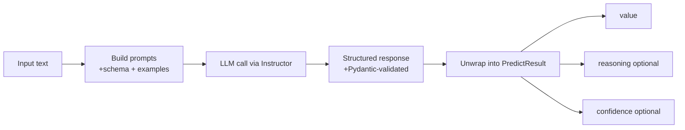
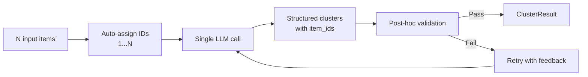

# llm-classifier

Structured classification and extraction on top of [Instructor](https://github.com/jxnl/instructor), with typed outputs via Pydantic.

## Why use it

- Return validated Pydantic models instead of free-form text
- Add few-shot examples directly in each call
- Optionally collect `reasoning` and `confidence`
- Reduce variance with consensus voting
- Run batched predictions with per-item error capture

## Installation

```bash
pip install llm-classifier
```

## Quickstart

```python
from typing import Literal
from pydantic import BaseModel
from llm_classifier import LLMClassifier


class Sentiment(BaseModel):
    label: Literal["positive", "negative", "neutral"]


clf = LLMClassifier(model="openai/gpt-4o")

result = clf.predict(
    input="This movie was amazing!",
    output_schema=Sentiment,
    examples=[
        ("I hated it", Sentiment(label="negative")),
        ("It was okay", Sentiment(label="neutral")),
    ],
    reasoning=True,
    confidence=True,
)

print(result.value.label)   # "positive"
print(result.reasoning)     # Optional[str]
print(result.confidence)    # Optional[float]
```

## How it works



## Core API

### Single prediction

```python
result = clf.predict(
    input="This is somewhat good",
    output_schema=Sentiment,
    consensus=5,
    consensus_parallel=True,
    max_parallel=3,
)

print(result.value)
print(result.compliant_variants)     # Variants matching selected output
print(result.noncompliant_variants)  # Variants not matching selected output
```

### Batch prediction

```python
batch = clf.batch_predict(
    inputs=["Great", "Bad", "Okay"],
    output_schema=Sentiment,
    parallel=True,
    max_parallel=5,
    cache_dir="./.llm_cache",
    cache_key="sentiment_run_2026_02_21",
)

print(batch.successes, batch.failures)
print(batch.values())   # [Sentiment | None, ...]
print(batch.errors)     # [(index, Exception), ...]
```

### Resumable batch cache

When `cache_dir` is set, each processed index is appended to a cache log so reruns skip already successful items.

- Metadata file: `<cache_dir>/<cache_key>.meta.json`
- Step log file: `<cache_dir>/<cache_key>.jsonl`
- If `cache_key` is omitted: `batch_<signature16>` is generated automatically

Each `.jsonl` line is one step record (`success` or `error`) with index and payload.
On rerun with the same `cache_dir` + `cache_key`, successful indices are loaded from cache and not reprocessed.

## Clustering with LLMCluster

For bulk clustering of many items in a **single LLM call**, use `LLMCluster`. This is ideal when you have many rows (e.g., 100 survey responses) and want to group them into high-level clusters without making N separate calls.

### Basic usage

```python
from pydantic import BaseModel
from llm_classifier import LLMCluster


class ClusterSchema(BaseModel):
    name: str
    summary: str


clusterer = LLMCluster(model="openai/gpt-4o")

surveys = [
    "The product quality is excellent!",
    "Shipping was too slow",
    "Great customer service",
    "Product broke after one week",
    "Fast delivery, very happy",
    "Support team was unhelpful",
]

result = clusterer.cluster(
    inputs=surveys,
    cluster_schema=ClusterSchema,
    reasoning=True,
    confidence=True,
)

for cluster in result.clusters:
    print(f"\n{cluster.cluster.name}: {cluster.cluster.summary}")
    for item in cluster.items:
        print(f"  - {item}")

print(f"\nReasoning: {result.reasoning}")
print(f"Confidence: {result.confidence}")
```

### How it works



Items are assigned numeric IDs `[1]` through `[N]`, and the LLM returns clusters referencing these IDs. Validation ensures referential integrity before returning results.

### Cluster schema

Define a Pydantic model for per-cluster fields. An `item_ids` field is automatically injected:

```python
class TopicCluster(BaseModel):
    name: str
    description: str
    sentiment: Literal["positive", "negative", "mixed"]
```

### Validation and retries

The clusterer validates LLM responses and retries on failures:

| Check | Behavior |
|-------|----------|
| Invalid ID (outside 1..N) | Always fails |
| Duplicate ID across clusters | Fails when `allow_overlap=False` (default) |
| Missing ID (item not in any cluster) | Fails when `require_all=True` (default) |
| Empty cluster | Always fails |

```python
result = clusterer.cluster(
    inputs=surveys,
    cluster_schema=ClusterSchema,
    allow_overlap=False,     # Each item in exactly one cluster
    require_all=True,        # Every item must be assigned
    max_retries=3,           # Instructor retries for malformed JSON
    validation_retries=2,    # Our retries for referential integrity errors
)

print(f"Validation retries used: {result.retries_used}")
```

### Cluster count hint

Let the LLM decide the number of clusters, or provide a hint:

```python
# LLM decides
result = clusterer.cluster(inputs=surveys, cluster_schema=ClusterSchema)

# Suggest 3 clusters
result = clusterer.cluster(inputs=surveys, cluster_schema=ClusterSchema, n_clusters=3)
```

### Error handling

```python
from llm_classifier import ClusterValidationError, ContextLengthError

try:
    result = clusterer.cluster(inputs=huge_list, cluster_schema=ClusterSchema)
except ContextLengthError as e:
    print(f"Too many items for model context: {e}")
except ClusterValidationError as e:
    print(f"Validation failed after retries: {e.errors}")
```

## Behavior notes

- `consensus` must be `>= 1`, else `ValueError`
- `max_parallel` must be `>= 1`, else `ValueError`
- `batch_predict(inputs=[])` raises `ValueError`
- If both prompts resolve to empty, prediction raises `ValueError`
- Consensus tie-break is deterministic: first-seen variant wins
- `cache_key` requires `cache_dir`
- Reusing a `cache_key` with different batch configuration raises `ValueError`

## Model support

Use any provider/model string supported by `instructor.from_provider(...)`, for example:

- `openai/gpt-4.1`
- `anthropic/claude-3-5-sonnet-20241022`
- `google/gemini-1.5-pro`

## License

Apache-2.0 License. See [LICENSE](./LICENSE) for details.
