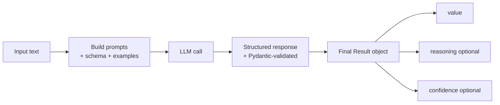
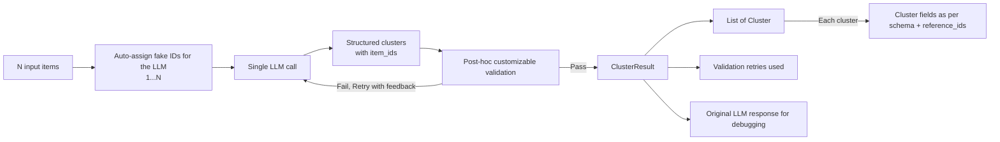

# llm-classifier

Structured LLM based classification, clustering and extraction framework that works with all major API providers ([see full list](https://python.useinstructor.com/)).

## Why use it

- Return validated Pydantic models instead of free-form text
- Add few-shot examples directly in each call (prebuilt prompts - can be customized/replaced with your own)
- Optionally collect `reasoning` and `confidence` to enhance results
- Reduce variance with consensus voting
- Run batched predictions with intermediate caches and per-item error capture
- Mutithreading support to speed up large batches

## Installation

```bash
pip install llm-classifier
```

## Quickstart

```python
from typing import Literal
from pydantic import BaseModel
from llm_classifier import LLMClassifier


## Can put in any fields you want as long as it is supported by the model's structured output capabilities. Here we just want a simple label.
class Sentiment(BaseModel):
    label: Literal["positive", "negative", "neutral"]


clf = LLMClassifier(model="openai/gpt-4.1-nano")

result = clf.predict(
    input="This movie was amazing!",
    output_schema=Sentiment,
    examples=[
        ("I hated it", Sentiment(label="negative")),
        ("It was okay", Sentiment(label="neutral")),
    ],
    reasoning=True,
    confidence=True,
)

print(result.value.label)   # "positive"
print(result.reasoning)     # Optional[str]
print(result.confidence)    # Optional[float]
```

## How it works



## Core API

### Single prediction with Consensus features

```python
result = clf.predict(
    input="This is somewhat good",
    output_schema=Sentiment,
    consensus=5,
    consensus_parallel=True,
    max_parallel=3,
)

print(result.value)
print(result.compliant_variants)     # Variants matching selected output
print(result.noncompliant_variants)  # Variants not matching selected output
```

### Batch prediction (Mutiple rows of data)

```python
batch = clf.batch_predict(
    inputs=["Great", "Bad", "Okay"],
    output_schema=Sentiment,
    parallel=True,
    max_parallel=5,
    cache_dir="./.llm_cache",
    cache_key="sentiment_run_2026_02_21",
)

print(batch.successes, batch.failures)
print(batch.values())   # [Sentiment | None, ...]
print(batch.errors)     # [(index, Exception), ...]
```

### Resumable batch cache

When `cache_dir` is set, each processed index is appended to a cache log so reruns skip already successful items.

- Cache file: `<cache_dir>/<cache_key>.jsonl` (defaults to `input_cache.jsonl` when `cache_key` is omitted)
- `cache_key` requires `cache_dir` to also be set, otherwise a `ValueError` is raised

Each `.jsonl` line is one step record keyed by a SHA-256 hash of the full input configuration (model, text, schema, examples, prompts, settings). On rerun with the same `cache_dir` + `cache_key`, already-cached inputs are skipped.

*Note: It is your responsibility to track token usage and API costs, this package is simply a framework to make repetetive tasks easier and more robust.*

## Clustering with LLMCluster

For bulk clustering of many items in a **single LLM call**, use `LLMCluster`. This is ideal when you have many rows (e.g., 100 survey responses) and want to group them into high-level clusters without making N separate calls. This approach is recommended for one time analyses for large datasets, where you can enable a strong reasoning model (eg: `gpt-5`) to get a result with one attempt - it will likely be less reliable than LLMClassifier / row by row approach but faster and potentially cheaper (Depending on the models you compare with).

### Basic usage

```python
from pydantic import BaseModel
from llm_classifier import LLMCluster


class ClusterSchema(BaseModel):
    name: str
    summary: str


clusterer = LLMCluster(model="openai/gpt-4.1")

surveys = [
    "The product quality is excellent!",
    "Shipping was too slow",
    "Great customer service",
    "Product broke after one week",
    "Fast delivery, very happy",
    "Support team was unhelpful",
]

# cluster() requires (index, text) tuples — use enumerate to build them
indexed_surveys = list(enumerate(surveys, 1))

result = clusterer.cluster(
    inputs=indexed_surveys,
    cluster_schema=ClusterSchema,
)

for cluster in result.clusters:
    print(f"\n{cluster.cluster.name}: {cluster.cluster.summary}")
    for idx, text in cluster.references:
        print(f"  [{idx}] {text}")
```

### How it works



### Cluster schema

Define a Pydantic model for per-cluster fields. A `reference_ids: list[int]` field is automatically injected at runtime to track which items belong to each cluster — you do not need to add it yourself:

```python
class TopicCluster(BaseModel):
    name: str
    description: str
    sentiment: Literal["positive", "negative", "mixed"]
```

### Validation and retries

The clusterer validates LLM responses and retries on failures:

| Check | Behavior |
|-------|----------|
| Invalid ID (outside 1..N) | Always fails |
| Duplicate ID across clusters | Fails when `allow_overlap=False` (default) |
| Missing ID (item not in any cluster) | Fails when `require_all=True` (default) |
| Empty cluster | Always fails |

```python
result = clusterer.cluster(
    inputs=list(enumerate(surveys, 1)),
    cluster_schema=ClusterSchema,
    allow_overlap=False,     # Each item in exactly one cluster
    require_all=True,        # Every item must be assigned
    max_retries=3,           # Instructor retries for malformed JSON
    validation_retries=2,    # Our retries for referential integrity errors
)

print(f"Validation retries used: {result.retries_used}")
```

### Cluster count hint

Let the LLM decide the number of clusters, or provide a hint:

```python
# LLM decides
result = clusterer.cluster(inputs=list(enumerate(surveys, 1)), cluster_schema=ClusterSchema)

# Suggest 3 clusters
result = clusterer.cluster(inputs=list(enumerate(surveys, 1)), cluster_schema=ClusterSchema, n_clusters=3)

# Free text
result = clusterer.cluster(inputs=list(enumerate(surveys, 1)), cluster_schema=ClusterSchema, n_clusters="3-5")
```

### Error handling

```python
from llm_classifier import ClusterValidationError, ContextLengthError

try:
    result = clusterer.cluster(inputs=list(enumerate(huge_list, 1)), cluster_schema=ClusterSchema)
except ContextLengthError as e:
    print(f"Too many items for model context: {e}")
except ClusterValidationError as e:
    print(f"Validation failed after retries: {e.errors}")
```

## Real-world examples

Runnable scripts are in the [`examples/`](./examples) folder. Each includes inline data so you only need an API key to run them.

## Key Note

The package is built on the exceptional ability of Large Language Models (LLMs) to understand text, context, and perform zero-shot tasks. The underlying models handle the heavy lifting of interpreting input and generating output, while this package provides a structured framework to interact with them in a more robust and reliable way.

As a result, the package inherits the same limitations as the underlying models. If the model struggles to understand a task, or if the input is ambiguous or overly complex, errors or unexpected results may occur. Always validate outputs and consider the model’s capabilities when designing your workflows.

Note that Large Language Models typically exhibit output variance, even with parameters such as `temperature=0`. Results are not guaranteed to be identical across runs. While features like `consensus`, `examples`, and `custom prompts` can help steer behavior toward more deterministic outcomes, LLMs are inherently non-deterministic systems. Keep this in mind when relying on generated outputs.

## Model support

Use any provider/model string supported by `instructor.from_provider(...)`, for example:

- `openai/gpt-4.1`
- `anthropic/claude-3-5-sonnet-20241022`
- `google/gemini-1.5-pro`

## License

Apache-2.0 License. See [LICENSE](./LICENSE) for details.
